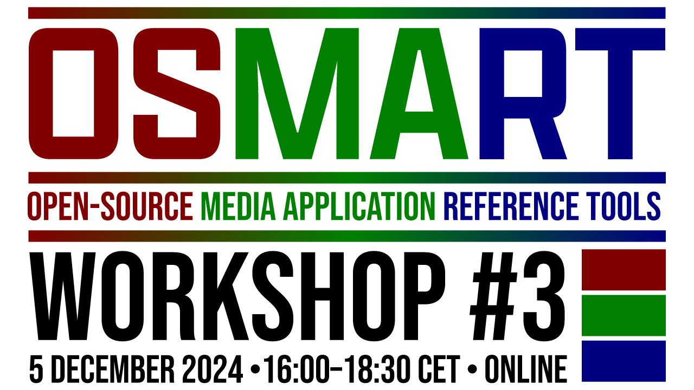

# Welcome to the OSMART Community 👋

The OSMART (Open-Source Media Application Reference Tools) workshop is a regular exchange involving the development of open-source software for media applications with a series of status updates and roadmaps on relevant projects from relevant organizations.

## OSMART Workshop #3

We are meeting again on the 5th December 2024. **[Register now!](./pages/osmart-workshop-3.html)**

## HOW WE STARTED
OSMART was kick-started in May 2022 when five organizations that develop and promote open standards for media distribution - the Consumer Technology Association WAVE Project, DASH Industry Forum, the DVB Project, the 5G Media Action Group (5G-MAG) and the HbbTV Association - came together for an online workshop. The key objective was to find synergies for collaboration within the organizations. A new edition in 2023 added MPEG and SVTA.

{: .note }
Raise an [issue](https://github.com/osmart-community/.github/issues) and give us your contact (GitHub handle) if you wish to be added to the Team.

# PAST WORKSHOPS

## OSMART Workshop #2
Check details [here](./pages/osmart-workshop-2.html)

## OSMART Workshop #1
Check details [here](./pages/osmart-workshop-2.html)
