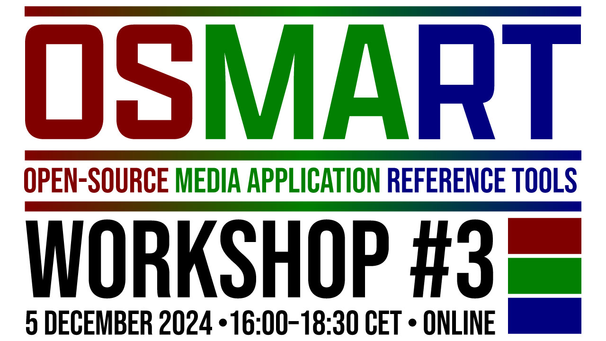

# 05.12.24 - OSMART Workshop #3

## REGISTER NOW!
### The workshop will take place on Zoom. You must **[register here](https://us06web.zoom.us/meeting/register/tZIpde-hqjgjH9Q7i_au6ixY2__3vWIybWvm)** to join.

---

## AGENDA

Precise timings will be added closer to the event.

### 5G-MAG
* Updates on 5G-MAG Reference Tools (Media Streaming, 5G Broadcast, XR, 5MBS, V3C, etc.) – by Jordi J. Giménez, Daniel Silhavy, Nils Duval, Richard Bradbury

### CTA WAVE
* Update on Joint Content Conformance Project (JCCP) – by Romain Bouqueau, MotionSpell
* Updates on CTA WAVE Streaming Media Test Suite - Devices – Louay Bassbouss (Fraunhofer FOKUS) 

### DVB Project
* Update on DVB-MABR (Multicast Adaptive Bitrate streaming) Verification & Validation - by Romain Bouqueau, MotionSpell
* DVB-I Reference Application: latest updates, including in relation to DVB-NIP (Native IP broadcasting) – by Juha Joki, Sofia Digital

### SVTA & DASH-IF
* DASH-IF livesim2 – a test ground for live DASH streaming – by Torbjörn Einarsson , Eyevinn
* dash.js – The open-source DASH Reference Player – by Daniel Silhavy, Fraunhofer FOKUS 
* CML - The SVTA Common Media Library - Casey Occhialini, Paramount 
* SVTA Sandbox - A framework to standup a streaming workflow - Jason Thibeault, SVTA

---

## BACKGROUND INFORMATION

### WHY ARE WE MEETING?
The main motivation behind OSMART Workshop #3 is to detect overlapping topics around streaming and media delivery in the different software projects and reference implementations made available by different industry organizations.

We aim at:
* detecting opportunities for cooperation
* update each other on the progress of the projects and availability of tools
* gather information about how to use the tools for testing and in production
* exchange information about challenges, opportunitities, methodology of work, etc.

### WHEN ARE WE MEETING?
5 December 2024, from 16:00 to 18:30 CET (15:00 to 17:30 UTC).

### WHERE ARE WE MEETING?
On-line via **[Zoom](https://us06web.zoom.us/meeting/register/tZIpde-hqjgjH9Q7i_au6ixY2__3vWIybWvm)**.

### WHO CAN ATTEND?
The workshop is public and free to attend. Everybody is welcome.

